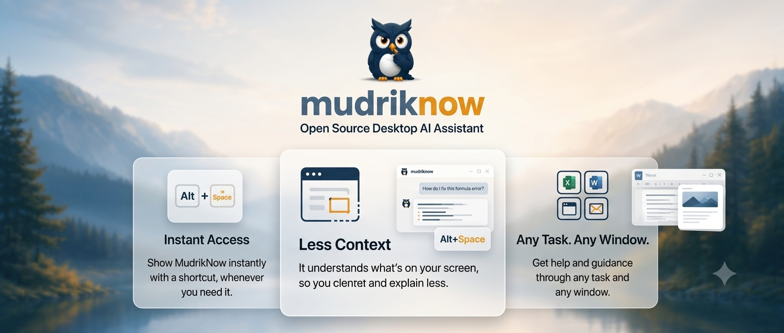

<div align="center">



# MudrikNow  ·  <span dir="rtl">مدرك</span>

***Stop explaining your screen to AI.*** **MudrikNow is an open-source desktop AI agent that sees what you see — and answers, acts, or guides you step-by-step through any task.**

[](LICENSE)
[](https://github.com/abdallahmagdy15/mudriknow/releases)
[](CHANGELOG.md)
[](https://abdallahmagdy15.github.io/mudriknow/)

[Website](https://abdallahmagdy15.github.io/mudriknow/) · [Install](#-install) · [Hotkeys](#%EF%B8%8F-hotkeys) · [About](#-about)

</div>

***

## 🎬 Demo

<p align="center"><a href="https://abdallahmagdy15.github.io/mudriknow/assets/Mudriknow-demo-v2.mp4" target="_blank"></a></p>

<div align="center"><em>▶ Click to play the demo</em></div>

***

## 💡 Why MudrikNow

<table>
<tr>
<td width="33%" valign="top" align="center"><strong>⚡ Instant Access</strong><br><em>Show MudrikNow instantly with a shortcut, whenever you need it.</em></td>
<td width="33%" valign="top" align="center"><strong>🪟 Less Context</strong><br><em>It understands what's on your screen, so you explain less.</em></td>
<td width="33%" valign="top" align="center"><strong>🎯 Any Task. Any Window.</strong><br><em>Get help and guidance through any task and any window.</em></td>
</tr>
</table>

***

## ✨ What it does

Trigger the hotkey and MudrikNow reads the full accessibility tree of your active window — every button, field, label, and value — **and** captures a full-screen screenshot with a coordinate grid. The tree gives precise automationIds + hidden metadata (deep text, off-screen state); the grid lets the model estimate coordinates when the tree is shallow (canvas, custom widgets, web content). It works across browsers, Office, IDEs, and native dialogs, then opens a floating panel anchored on the element you're hovering.

From there it's not just chat — it's an AI agent. Flip on **Auto-Guide** and it switches from *doing* to *teaching*: an owl pointer appears, lands on each target with a speech bubble, and walks you through the task one click at a time.

## 🚀 Install

> 🌍 Currently **Windows** · macOS & Linux on the roadmap.

1. Install **[Node.js ≥ 20](https://nodejs.org/)**.
2. Install OpenCode (auth optional — keys can live in-app):
   ```bash
   npm i -g opencode-ai
   ```
3. Download the latest `.exe` from [Releases](https://github.com/abdallahmagdy15/mudriknow/releases) and run it.
4. **Connect your AI model.** On first launch MudrikNow opens settings and highlights **Add a model** for you. Pick a provider, paste your key, click **Verify**, then choose a model. Any time: **⚙ → Model → Add a model**.

> 💡 **Multimodal (vision) model recommended** — MudrikNow auto-captures a screenshot on every activation. For free/light use, **Google Gemini Flash-Lite** is a great pick ([aistudio.google.com](https://aistudio.google.com/) → API key).

> Installer is **unsigned** — SmartScreen will warn on first launch. *More info → Run anyway*.

**From source:** `git clone https://github.com/abdallahmagdy15/mudriknow && cd mudriknow && npm install && npm start`

> **Windows build prerequisite:** `npm install` requires Visual Studio with the **"Desktop development with C++"** workload (for `robotjs` and `koffi` native compilation). Node.js ≥ 20 LTS recommended. See [`AGENTS.md`](AGENTS.md) for full details.

## ⌨️ Hotkeys

Two global hotkeys put MudrikNow in front of you. Both are rebindable from the ⚙ menu.

| Shortcut     | What happens |
| ------------ | ------------ |
| `Alt+Space`  | Reads your active window's full UI and anchors on what you're pointing at. MudrikNow opens on the opposite side of your screen, ready to help. |
| `Alt+X`      | Quick chat — opens the panel instantly without capturing context. For questions that don't need screen awareness. |
| `Esc`        | Cancel: stops streaming or closes the panel. |
| `Enter`      | Send prompt. `Shift+Enter` for newline. |

## 🛠 Features

| <br />                       | <br />                                                                                                                                                                                                        |
| ---------------------------- | ------------------------------------------------------------------------------------------------------------------------------------------------------------------------------------------------------------- |
| 🦉 **Auto-Guide**             | MudrikNow becomes a teacher: an owl cursor appears on screen, points to each target with a speech bubble, and walks you step‑by‑step through multi‑step UI tasks. Toggle in ⚙ settings.                            |
| 💬 **Quick chat mode**        | `Alt+X` opens the panel without capturing context — for questions that don't need screen awareness. MudrikNow is always one keystroke away, even when you just need a quick answer.                                |
| 🔌 **Any LLM**               | 140+ providers via [OpenCode](https://opencode.ai) + [models.dev](https://models.dev) — NVIDIA, Anthropic, OpenAI, Google, DeepSeek, OpenRouter, and more. Pick a provider, paste your key, and **Verify** it works before you trust it. **Vision (multimodal) models recommended** — MudrikNow auto-screenshots every activation; Google Gemini Flash-Lite is a great free pick.                           |
| 🔒 **Sandboxed**             | Read-only shell for diagnostics — writes, deletes, and piping are blocked (violations kill the session). No filesystem writes. The AI reads files in your working directory and dispatches an allow-listed set of UI actions. That's the whole capability surface.                                   |

## 🧠 How it works

```
Alt+Space (pointer)
  ↓  hotkey reads cursor position
  ↓  PowerShell UIA script — JSON tree of the active window
  ↓  full-screen screenshot + coordinate grid, captured every time
  ↓  MudrikNow opens on the opposite side of your screen, ready to chat

Alt+X (quick chat)
  ↓  panel opens instantly — no context capture
  ↓  for questions that don't need screen awareness

Send prompt
  ↓  streamed to `opencode run --agent readonly`
  ↓  tokens render live; <!--ACTION:{...}--> markers parsed
  ↓  actions execute via UIA or robotjs

Auto-Guide mode (opt-in via ⚙)
  ↓  AI emits guide_offer → user accepts
  ↓  owl cursor appears with speech bubble, panel hides
  ↓  owl points → user clicks → AI advances
  ↓  guide_complete → "Done!" → panel returns
```

Full architecture in **[AGENTS.md](AGENTS.md)**.

## 🔒 Privacy & Security

MudrikNow runs the AI in a sandbox with deliberately narrow capabilities:

| Capability                                        | Exposed to the model?              |
| ------------------------------------------------- | ---------------------------------- |
| Shell / PowerShell exec                           | 🟡 Read-only only (mutation/pipes blocked) |
| Filesystem **write**                              | ❌ No                              |
| Filesystem **read** (`read`/`grep`/`glob`/`list`) | ✅ Yes (within working directory)  |
| Windows UI Automation                             | ✅ Yes (pre-defined action set)    |
| Keyboard / mouse                                  | ✅ Yes (when UIA can't reach a target) |
| Screen pixels                                     | ✅ Auto on every Alt+Space |

Full threat model + reporting in **[SECURITY.md](SECURITY.md)**.

## 👋 About

Hi, I'm **Abdullah Magdy**.

A senior dev who got tired of explaining context to AI chats — so I built MudrikNow on nights and weekends. Open source so you can see (and improve) every line.

- 🐙 GitHub — [@abdallahmagdy15](https://github.com/abdallahmagdy15)
- 🐦 X / Twitter — [@AbdallahMagdyy](https://x.com/AbdallahMagdyy)
- 💼 LinkedIn — [abdallahmagdy15](https://www.linkedin.com/in/abdallahmagdy15/)
- ✉️ `abdallah.magdy1515@gmail.com`

For security issues use **[GitHub Private Vulnerability Reporting](https://github.com/abdallahmagdy15/mudriknow/security/advisories/new)** (or email as fallback) — not public issues.

## 🤝 Contributing

PRs welcome. MudrikNow is TypeScript end-to-end (main, preload, renderer, shared types) — the single source of truth for IPC channels, action types, and config shape lives in [`src/shared/types.ts`](src/shared/types.ts).&#x20;

Setup, build pipeline, and release flow in **[CONTRIBUTING.md](CONTRIBUTING.md)**. Code of Conduct in **[CODE\_OF\_CONDUCT.md](CODE_OF_CONDUCT.md)**.

## 🙏 Acknowledgements

- **[OpenCode](https://opencode.ai)** — handles streaming, providers, auth so MudrikNow doesn't have to.
- **[Electron](https://electronjs.org)** · **[React](https://react.dev)** · **[robotjs](https://github.com/octalmage/robotjs)** · **Windows UI Automation**.

## 📄 License

[MIT](LICENSE) — fork it, modify it, ship it, sell it. Just keep the copyright notice in the LICENSE file.

***

<div align="center"><sub>MudrikNow · <span dir="rtl">مدرك</span> · the aware</sub></div>
